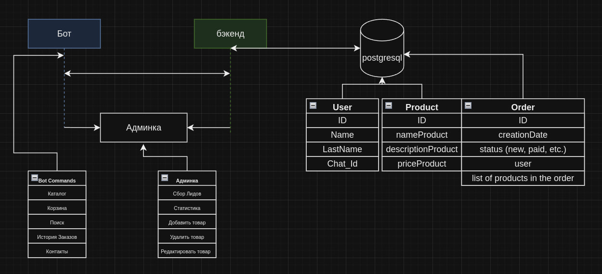
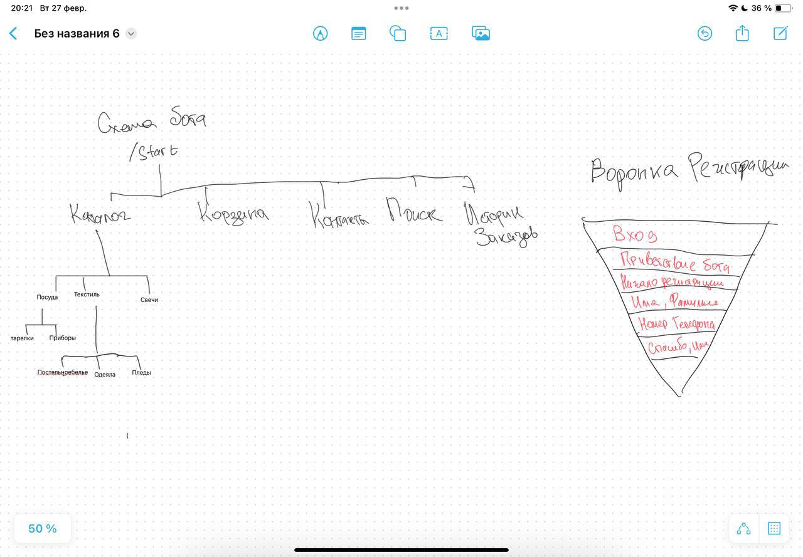

# DishBot

### Реализовать
### Категории (Category)
- [x] Сущность `Category`
- [x] `CategoryRepository`
- [x] `CategoryService`
- [x] Метод для добавления новой корневой категории
- [x] Метод для добавления новой дочерней категории к существующей родительской
- [x] Метод для удаления категории и всех её дочерних категорий
- [x] Рефакторинг методов `Category`
- [x] Добавление `InlineKeyboardMarkup` прямо в ответах

### Продукты (Product)
- [x] Сущность `Product`
- [x] `ProductRepository`
- [x] `ProductService`
- [x] Метод для добавления нового продукта
  - [x] Поддержка загрузки и хранения изображения продукта
  - [x] Поле для категории продукта
  - [x] Поле для названия продукта
  - [x] Поле для описания продукта
  - [x] Поле для цены продукта
- [x] Метод для обновления информации о продукте
- [x] Метод для удаления продукта
- [x] Реализация функциональности добавления продукта через интерфейс пользователя (форма добавления)
- [x] Валидация входных данных на стороне сервера

### Начать реализовывать платформу Админки!

#### Страница входа

- [x] Разработать макет страницы входа.
- [x] Реализовать форму входа с полями для логина и пароля.
- [x] Настроить аутентификацию и авторизацию пользователя.
- [ ] Обеспечить безопасность с помощью Spring Security
- [ ] Протестировать и убедиться в корректности работы страницы входа.

#### Главная страница

- [x] Создать макет главной страницы с продукт-листом.
- [x] Реализовать отображение списка товаров с основной информацией.
- [x] Реализовать функции редактирования и удаления товаров.
- [x] Добавить возможность сортировки и фильтрации списка товаров.
- [x] Подготовить интерфейс для перехода к добавлению новых товаров и категорий.

#### Страница добавления категорий

- [x] Определить макет страницы для добавления категорий.
- [x] Разработать форму добавления категории с необходимыми полями.
- [x] Реализовать логику создания новых категорий в базе данных.
- [x] Предусмотреть возможность возвращения к списку категорий без сохранения изменений.
- [x] Обеспечить валидацию данных формы на клиентской и серверной стороне.

### Интеграция с внешними сервисами

### Бот 
- [x] Реализовать сбор контактов(Регистрацию)
- [x] Реализовать Каталог
- [X] Реализовать обратную связь
- [ ] Добавить функцию поиска в боте
- [ ] Добавить Карзину
- [ ] Добавить историю Заказов

### Добавить тесты!!

- [ ] Исправить баг не сохраняет фото карточек на сервере